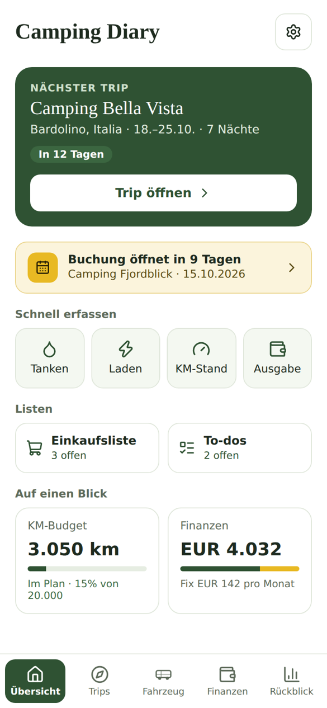
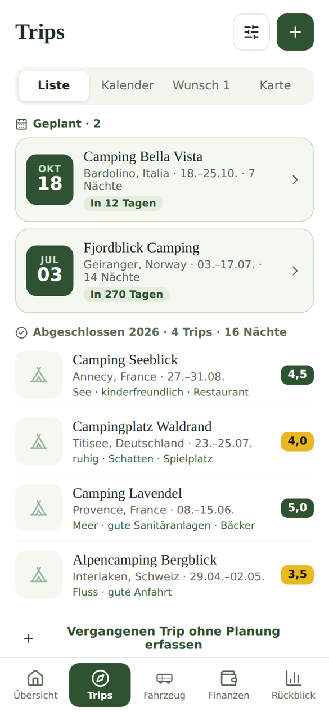
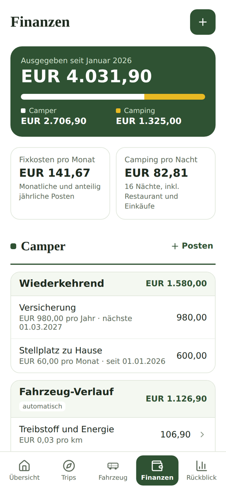

# Camping Diary

Deutsch · [English](README.md)

Eine selbst gehostete Web-App für Campingreisen mit dem eigenen Campervan oder Wohnmobil.
Plane kommende Trips, halte nach jedem Trip einen kurzen Bericht fest, behalte Tanken, Laden,
Kilometer und Kosten im Blick und schau auf alles zurück, was ihr unternommen habt. Die App
läuft in Docker auf dem eigenen Server oder NAS, funktioniert auf dem Handy wie eine richtige
App und ist auf Deutsch und Englisch verfügbar.

<p>
  
  
  
</p>

## Funktionen

- **Trips:** kommende Reisen mit Packliste, Einkaufsliste, To-dos und Essensplan,
  Wettervorhersage und Fahrdistanz ab Zuhause. Kalenderansicht mit .ics-Export und eine
  Wunschliste für Plätze, die ihr noch buchen wollt, mit Erinnerung, wenn das Buchungsfenster
  öffnet.
- **Erfahrungsberichte:** Bewertung, Kosten pro Nacht, Restaurant und Aktivitäten,
  Stellplatzgrösse, Tags, Fotos und Lessons Learnt zu jedem abgeschlossenen Trip. Suchen und
  filtern nach Ort, Bewertung, Jahr und Tags.
- **Fahrzeug:** Tanken und Laden, Kilometerstand mit Jahresbudget, Service, Reparaturen und
  Nachrüstungen mit Verlauf.
- **Finanzen:** Fixkosten (zum Beispiel Leasing, Versicherung, Parkplatz) mit Anrechnung ab
  Fälligkeitsdatum, dazu alle Kosten aus Erfahrungsberichten und Fahrzeug-Verlauf.
- **Rückblick:** Statistiken, Lessons Learnt und eine Karte aller Orte.
- **Schnellerfassung** für Tanken, Laden, Kilometerstand und Ausgaben direkt auf der Übersicht.
- **Mehrere Personen** können dieselbe Installation nutzen; Änderungen erscheinen auf allen
  Geräten.
- **Zwei Währungen:** eine Hauptwährung und optional eine zweite, die zum Tageskurs
  umgerechnet wird.
- **Deutsch und Englisch,** wählbar bei der Einrichtung oder später in den Einstellungen.

## Wichtig: Es gibt kein Login

Camping Diary hat keine Benutzerkonten und kein Passwort. Wer den Server erreicht, kann alles
lesen und ändern. Betreibe die App deshalb nur im Heimnetz oder hinter einem VPN wie
[Tailscale](https://tailscale.com) oder WireGuard und mache sie nie direkt im Internet
erreichbar.

## Installation

Du brauchst ein Gerät mit Docker und Docker Compose (zum Beispiel ein Synology- oder QNAP-NAS,
einen Raspberry Pi 4 oder 5 oder einen beliebigen Linux-Server).

```
git clone https://github.com/homeautoak-svg/cali-diaries-app-public.git camping-diary
cd camping-diary
cp .env.example .env
docker compose up -d --build
```

Der erste Build dauert ein paar Minuten. Danach `http://<dein-server>:4000` im Browser öffnen.
Beim ersten Start fragt eine kurze Einrichtung nach Sprache, Startort, Währung und Name des
Fahrzeugs, danach folgt eine kurze Einführung in die App.

Auf dem Handy wie eine App nutzen: Adresse in Safari (iPhone) oder Chrome (Android) öffnen und
"Zum Home-Bildschirm" wählen.

### Aktualisieren

```
git pull
docker compose up -d --build
```

Danach die App auf dem Handy ganz schliessen und neu öffnen.

### Deine Daten

- Alle Daten liegen in den Ordnern `data` (Datenbank) und `uploads` (Fotos) neben
  `docker-compose.yml`. Sie bleiben bei Updates und beim Neubau des Containers erhalten.
  Sichere beide Ordner regelmässig.
- In den Einstellungen lässt sich ausserdem alles als JSON-Datei exportieren, die
  Erfahrungsberichte auch als CSV.

### HTTPS und Zugriff von unterwegs (optional)

Für den Zugriff von unterwegs eignet sich Tailscale, auch bei Anschlüssen ohne öffentliche
IP-Adresse:

1. Tailscale auf dem Server und den Handys installieren und mit demselben Tailnet verbinden.
2. In der Tailscale-Admin-Konsole unter **DNS** die Option **HTTPS Certificates** aktivieren.
3. Auf dem Server ein Zertifikat erzeugen, zum Beispiel:
   ```
   mkdir -p certs
   tailscale cert --cert-file certs/cert.pem --key-file certs/key.pem dein-server.dein-tailnet.ts.net
   ```
4. In der `.env` eintragen:
   ```
   TLS_CERT_FILE=/app/certs/cert.pem
   TLS_KEY_FILE=/app/certs/key.pem
   TLS_PORT=4443
   ```
5. Nochmals `docker compose up -d --build` ausführen. Die App ist dann unter
   `https://dein-server.dein-tailnet.ts.net:4443` erreichbar.

Tailscale-Zertifikate sind 90 Tage gültig. Trag das Ausstellungsdatum in den Einstellungen
ein, dann erinnert dich die App rechtzeitig vor dem Ablauf.

## Verwendete Dienste

Die App ruft diese kostenlosen Dienste direkt auf, ohne API-Schlüssel. Bitte halte dich an
deren Nutzungsbedingungen; die App ist für den privaten Gebrauch mit wenigen Anfragen gedacht.

| Dienst | Wofür |
| --- | --- |
| [OpenStreetMap](https://www.openstreetmap.org)-Kacheln über [Leaflet](https://leafletjs.com) | Karte |
| [Nominatim](https://nominatim.org) | Orte und Länder finden |
| [OSRM](https://project-osrm.org) | Fahrdistanz |
| [Overpass API](https://overpass-api.de) | Restaurants und Badestellen in der Nähe |
| [Open-Meteo](https://open-meteo.com) | Wettervorhersage und Wetterverlauf |
| [Frankfurter](https://frankfurter.app), [open.er-api.com](https://open.er-api.com) | Wechselkurse |

## Entwicklung

```
npm install
npx esbuild src/main.jsx --bundle --outfile=public/bundle.js --loader:.jsx=jsx --jsx=automatic --minify
PORT=4000 npm start
```

Danach `http://localhost:4000` öffnen. Das Backend ist eine einzelne Express-Datei
(`server.js`) mit SQLite (`better-sqlite3`), das Frontend eine einzelne React-Datei
(`src/App.jsx`). Die Kommentare im Code sind deutsch. Texte der Oberfläche stehen im Code auf
Deutsch, die englischen Fassungen in `src/i18n-en.js`; neue Texte brauchen dort einen Eintrag.

## Lizenz

[MIT](LICENSE)

Made with Love by Andy and Claude.
