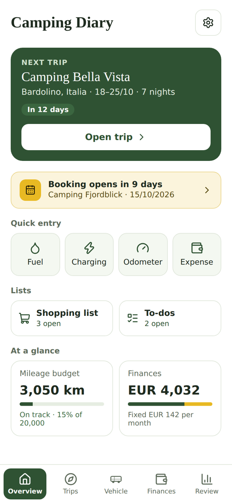
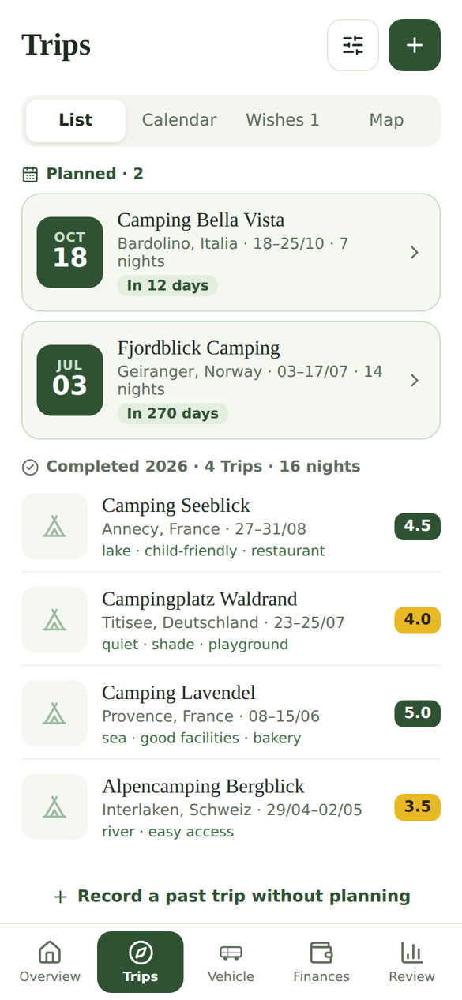
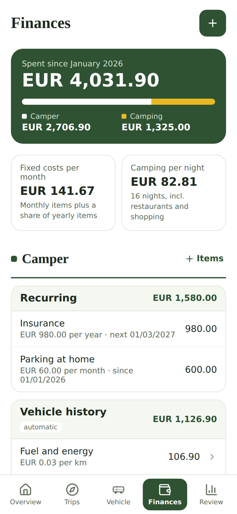

# Camping Diary

[Deutsch](README.de.md) · English

A self-hosted web app for camping trips with your own campervan or motorhome. Plan upcoming
trips, write a short report after each one, keep track of fuel, charging, mileage and costs,
and look back on everything you have done. The app runs in Docker on your own server or NAS,
works on the phone like a native app and is available in German and English.

<p>
  
  
  
</p>

## Features

- **Trips:** upcoming trips with packing list, shopping list, to-dos and meal plan, a weather
  forecast and the driving distance from home. A calendar view with .ics export and a wish
  list for campsites you still want to book, with a reminder when booking opens.
- **Trip reports:** rating, costs per night, restaurants and activities, pitch size, tags,
  photos and lessons learnt for every finished trip. Search and filter by place, rating, year
  and tags.
- **Vehicle:** fuel and charging, odometer readings with a yearly mileage budget, service,
  repairs and upgrades with a history.
- **Finances:** fixed costs (for example lease, insurance, parking) with date based accrual,
  plus all costs from trip reports and the vehicle history.
- **Review:** statistics, lessons learnt and a map of all places.
- **Quick entry** for fuel, charging, mileage and expenses straight from the overview.
- **Several people** can use the same installation; changes appear on all devices.
- **Two currencies:** a main currency and an optional second one that is converted at the
  daily rate.
- **German and English,** chosen during setup or later in the settings.

## Important: there is no login

Camping Diary has no user accounts and no password. Anyone who can reach the server can read
and change everything. Only run it in your home network or behind a VPN such as
[Tailscale](https://tailscale.com) or WireGuard, and never expose it directly to the internet.

## Installation

You need a machine with Docker and Docker Compose (for example a Synology or QNAP NAS, a
Raspberry Pi 4 or 5, or any Linux server).

```
git clone https://github.com/homeautoak-svg/cali-diaries-app-public.git camping-diary
cd camping-diary
cp .env.example .env
docker compose up -d --build
```

The first build takes a few minutes. Then open `http://<your-server>:4000` in the browser. On
the first start a short setup asks for language, home location, currency and vehicle name,
followed by a quick introduction to the app.

To use it on the phone like an app: open the address in Safari (iPhone) or Chrome (Android)
and choose "Add to Home Screen".

### Updating

```
git pull
docker compose up -d --build
```

Then close the app on the phone completely and open it again.

### Your data

- All data lives in the folders `data` (database) and `uploads` (photos) next to
  `docker-compose.yml`. They are kept when you update or rebuild the container. Back up both
  folders regularly.
- In the settings you can also export everything as a JSON file, or the trip reports as CSV.

### HTTPS and access from anywhere (optional)

For access on the road, Tailscale works well, also behind connections without a public IP
address:

1. Install Tailscale on the server and on your phones and connect them to the same tailnet.
2. In the Tailscale admin console enable **HTTPS Certificates** under **DNS**.
3. Create a certificate on the server, for example:
   ```
   mkdir -p certs
   tailscale cert --cert-file certs/cert.pem --key-file certs/key.pem your-server.your-tailnet.ts.net
   ```
4. Set in `.env`:
   ```
   TLS_CERT_FILE=/app/certs/cert.pem
   TLS_KEY_FILE=/app/certs/key.pem
   TLS_PORT=4443
   ```
5. Run `docker compose up -d --build` again. The app is then available at
   `https://your-server.your-tailnet.ts.net:4443`.

Tailscale certificates are valid for 90 days. Enter the issue date in the settings and the app
reminds you before it expires.

## Services used

The app calls these free services directly, without API keys. Please respect their usage
policies; the app is designed for personal use with a small number of requests.

| Service | Used for |
| --- | --- |
| [OpenStreetMap](https://www.openstreetmap.org) tiles via [Leaflet](https://leafletjs.com) | map |
| [Nominatim](https://nominatim.org) | finding places and countries |
| [OSRM](https://project-osrm.org) | driving distance |
| [Overpass API](https://overpass-api.de) | restaurants and swimming spots nearby |
| [Open-Meteo](https://open-meteo.com) | weather forecast and history |
| [Frankfurter](https://frankfurter.app), [open.er-api.com](https://open.er-api.com) | exchange rates |

## Development

```
npm install
npx esbuild src/main.jsx --bundle --outfile=public/bundle.js --loader:.jsx=jsx --jsx=automatic --minify
PORT=4000 npm start
```

Then open `http://localhost:4000`. The backend is a single Express file (`server.js`) with
SQLite (`better-sqlite3`); the frontend is a single React file (`src/App.jsx`). Code comments
are in German. User interface texts are written in German in the code and translated to
English in `src/i18n-en.js`; new texts need an entry there.

## Licence

[MIT](LICENSE)

Made with Love by Andy and Claude.
